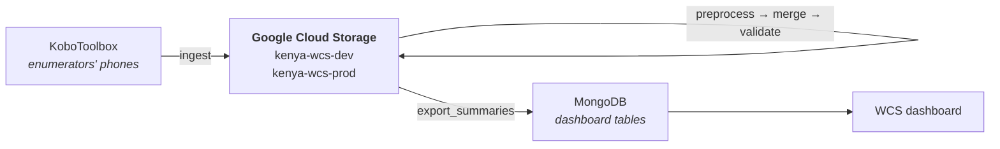
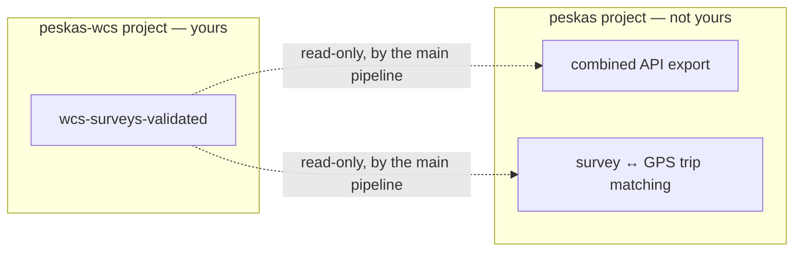
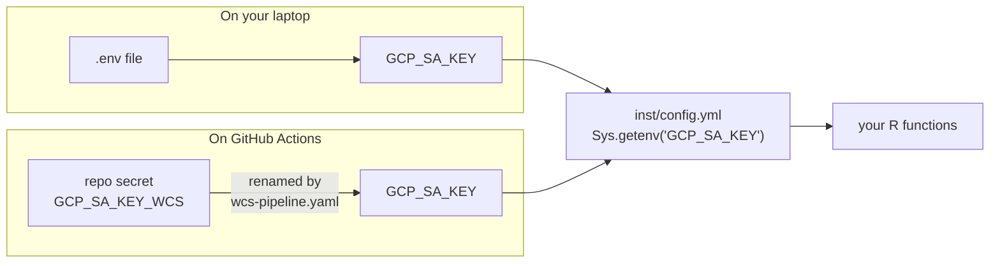
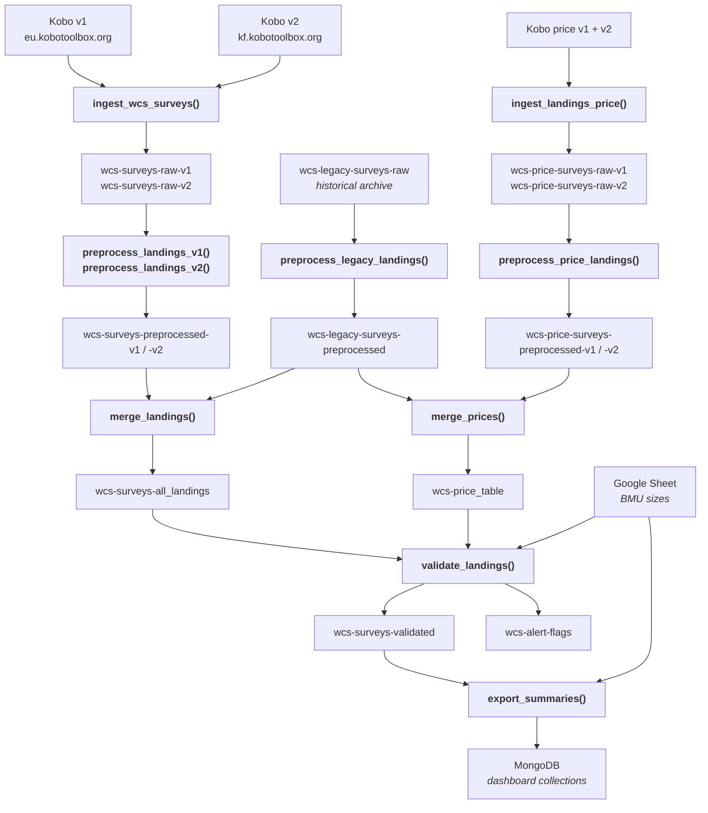
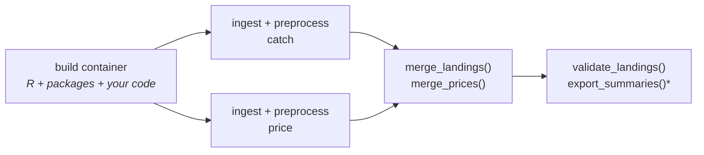
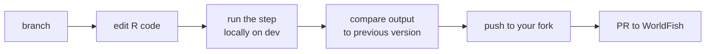

# WCS collaborator guide

## 1. The 60-second picture

The pipeline is just a set of R functions. Each one **downloads a file, transforms it, and uploads a new file**. Nothing runs in a database engine, nothing is a black box — every step is R code in `R/*.R` that you can run line by line on your laptop.



Three places data lives:

| Where | What it holds | Format |
|---|---|---|
| **KoboToolbox** | the raw survey submissions, as filled in the field | JSON via API |
| **Google Cloud Storage** ("the buckets") | every intermediate and final data file | Parquet |
| **MongoDB** | the pre-computed tables the dashboard reads | collections |

Everything between Kobo and MongoDB is a file in a bucket. If you understand the buckets, you understand the pipeline.

---

## 2. Your sandbox — and its one boundary

Two buckets exist for WCS data. They live in their own Google Cloud project, `peskas-wcs`, hosted in Doha (`ME-CENTRAL1`).

| Bucket | Used when | Your access |
|---|---|---|
| `kenya-wcs-dev` | the default — development, testing, anything you run by hand | read + write |
| `kenya-wcs-prod` | the live data behind the dashboard | read + write |

The wider Peskas system has other buckets (`kenya-dev`, `kenya-prod`, `peskas-coasts`, `peskas-api-*`) holding KEFS surveys, GPS tracks and multi-country exports. **You have no access to those, and no WCS function touches them.**

There is exactly one place the two worlds meet:



`wcs-surveys-validated` is the last file your chain produces, and two functions in the *main* pipeline read it. They only read. Nothing writes back into your buckets. Practically this means: **if you change the columns of `wcs-surveys-validated`, tell Lore** — it will ripple into the combined outputs. Everything else you can change freely.

---

## 3. One-time setup

### 3.1 Fork the repository

Go to <https://github.com/WorldFishCenter/peskas.kenya.data.pipeline> and click **Fork**. You now have your own copy, e.g. `github.com/<your-username>/peskas.kenya.data.pipeline`.

Then clone it locally:

```bash
git clone https://github.com/<your-username>/peskas.kenya.data.pipeline.git
cd peskas.kenya.data.pipeline
```

Keep a link back to the original so you can pull in Lore's changes later:

```bash
git remote add upstream https://github.com/WorldFishCenter/peskas.kenya.data.pipeline.git
git fetch upstream
```

### 3.2 Put your credentials in a `.env` file

You were given a file containing your credentials. **Rename it to exactly `.env` and put it in the project root** — the package looks for that filename and no other:

```bash
mv ~/Downloads/.env.wcs .env
chmod 600 .env
```

`.env` is listed in `.gitignore`, so git will never commit it. Never paste its contents into a chat, an issue, or a commit.

What's inside, and what each line is for:

| Variable | What it is | Needed for |
|---|---|---|
| `GCP_SA_KEY` | your Google Cloud key, as one long line of JSON | every step (reading/writing buckets) |
| `KOBO_ASSET_ID`, `KOBO_USERNAME`, `KOBO_PASSWORD` | WCS catch survey form on `eu.kobotoolbox.org` (v1) | `ingest_wcs_surveys()` |
| `KOBO_ASSET_ID_KF`, `KOBO_USERNAME_KF`, `KOBO_PASSWORD_KF` | WCS catch survey form on `kf.kobotoolbox.org` (v2) | `ingest_wcs_surveys()` |
| `KOBO_ASSET_ID_PRICE`, `KOBO_ASSET_ID_PRICE_KF` | the two fish-price forms | `ingest_landings_price()` |
| `GOOGLE_SHEET_ID` | the metadata spreadsheet holding BMU names and sizes | `validate_landings()`, `export_summaries()` |
| `MONGODB_CONNECTION_STRING` | where the dashboard tables get written | `export_summaries()` only |

> **On `GCP_SA_KEY`:** a *service account* is a robot user. The JSON is its password. It must sit on **one single line** — the `\n` sequences inside it are literal backslash-n characters, not real line breaks. If your editor "prettifies" the JSON across multiple lines, the file stops working (see [§9](#9-when-something-breaks)).

### 3.3 Install the package

```r
install.packages("remotes")
remotes::install_github("WorldFishCenter/peskas.coasts")  # shared helper package
remotes::install_local(dependencies = TRUE)               # this package
```

`peskas.coasts` is a companion package shared by all Peskas countries. It provides the upload/download helpers (`upload_parquet_to_cloud()`, `download_parquet_from_cloud()`) and the MongoDB helpers. You will see it everywhere in the code.

### 3.4 Check it works

Restart R in the project directory and run:

```r
library(peskas.kenya.data.pipeline)

conf <- read_config()
conf$storage$google$options_wcs$bucket
#> [1] "kenya-wcs-dev"

# pull the most recent validated dataset out of the bucket
valid <- coasts::download_parquet_from_cloud(
  prefix   = conf$surveys$wcs$catch$validated$file_prefix,
  provider = conf$storage$google$key,
  options  = conf$storage$google$options_wcs
)
dplyr::glimpse(valid)
```

If that returns a data frame, your setup is complete. If it errors, jump to [§9](#9-when-something-breaks).

### 3.5 Set up your fork's GitHub Actions

This is only needed if you want the pipeline to run **automatically on GitHub** rather than from your laptop. If you plan to work locally for now, skip to [§4](#4-how-configuration-works) and come back later.

**a) Turn off the main pipeline in your fork.** Your fork inherits the workflow `Peskas Kenya Data Pipeline`, which runs the *whole* system (KEFS, GPS, the lot). In your fork it has no credentials for any of that and will fail noisily on every push. Go to your fork → **Actions** tab → *Peskas Kenya Data Pipeline* → **⋯** → **Disable workflow**.

**b) Add your secrets.** A GitHub "secret" is an encrypted variable that workflows can read but nobody can print. Go to your fork → **Settings** → **Secrets and variables** → **Actions** → **New repository secret**, and add:

| Secret name | Value |
|---|---|
| `GCP_SA_KEY_WCS` | the same one-line JSON as `GCP_SA_KEY` in your `.env` |
| `KOBO_ASSET_ID` | same as in `.env` |
| `KOBO_ASSET_ID_PRICE` | same as in `.env` |
| `KOBO_USERNAME` | same as in `.env` |
| `KOBO_PASSWORD` | same as in `.env` |
| `KOBO_ASSET_ID_KF` | same as in `.env` |
| `KOBO_ASSET_ID_PRICE_KF` | same as in `.env` |
| `KOBO_USERNAME_KF` | same as in `.env` |
| `KOBO_PASSWORD_KF` | same as in `.env` |
| `GOOGLE_SHEET_ID` | same as in `.env` |
| `MONGODB_CONNECTION_STRING_WCS` | same as `MONGODB_CONNECTION_STRING` in your `.env` |

> **Why two names for the same thing?** On GitHub the Google key is stored as `GCP_SA_KEY_WCS`; the workflow then hands it to R under the name the code expects, `GCP_SA_KEY`. Same for MongoDB. The rename exists so that the WCS key and the main key can coexist in the same repository without one overwriting the other. You never see this indirection locally — in `.env` you use the plain names.



**c) Point the container image at your own account.** The workflow builds a Docker image (a pre-baked Linux machine with R and all packages installed) and pushes it to GitHub's registry. The address is hardcoded to WorldFish's account, and your fork isn't allowed to write there — the build job will fail with a permissions error. Fix it once, in your fork, by replacing the account name with your own **lowercase** GitHub username:

```bash
sed -i '' 's|ghcr.io/worldfishcenter/|ghcr.io/<your-username>/|g' \
  .github/workflows/build-container.yaml \
  .github/workflows/wcs-pipeline.yaml
git commit -am "point container image at my fork"
git push
```

Keep this commit on your fork only — don't include it in pull requests back to WorldFish.

---

## 4. How configuration works

There is one configuration file: [`inst/config.yml`](inst/config.yml). Every function starts with `conf <- read_config()` and then reads values out of `conf`. Nothing is hardcoded.

Two mechanisms are worth understanding.

### Secrets come from the environment

Lines like this appear throughout the file:

```yaml
service_account_key: !expr Sys.getenv('GCP_SA_KEY')
```

`!expr` means "run this R code when the config is loaded". So the config file itself contains **no** passwords — it contains instructions to fetch them from your environment, which `read_config()` populates from your `.env`. That's why the config can live safely in a public repository.

### Profiles switch the buckets

The file has three named profiles. They all share the same settings except for which buckets and databases get used:

| Profile | WCS bucket | MongoDB database |
|---|---|---|
| `default` ← *you get this unless you say otherwise* | `kenya-wcs-dev` | `app-dev` |
| `local` | `kenya-wcs-dev` | `app-dev` |
| `production` | `kenya-wcs-prod` | `app` |

To switch, set an environment variable before calling anything:

```r
Sys.setenv(R_CONFIG_ACTIVE = "production")
read_config()$storage$google$options_wcs$bucket
#> [1] "kenya-wcs-prod"

Sys.setenv(R_CONFIG_ACTIVE = "default")   # back to dev
```

**Work in `default` (dev) unless you have a specific reason not to.** Dev is a full copy of the data — you can break it and reseed it. Production is what the dashboard shows.

### The block that matters to you

Inside `config.yml`, storage targets are grouped in named blocks. Yours is `options_wcs`:

```yaml
storage:
  google:
    options:        # kenya-dev / kenya-prod   — KEFS + GPS. Not yours.
    options_coasts: # peskas-coasts*           — multi-country. Not yours.
    options_api:    # peskas-api-*             — combined export. Not yours.
    options_wcs:    # kenya-wcs-dev / -prod    — ALL WCS data. Yours.
      project: peskas-wcs
      bucket: kenya-wcs-dev
      service_account_key: !expr Sys.getenv('GCP_SA_KEY')
```

Every WCS function passes `options = conf$storage$google$options_wcs` to its upload/download calls. **If you add a step to the WCS chain, use `options_wcs`.** Using `options` would send WCS data into the shared bucket (and fail, since your key has no access there).

---

## 5. How files are named

Files are never overwritten. Every upload creates a new object with a timestamp and the git commit it came from stamped into the name:

```
wcs-surveys-validated__20260809100043_0f437e0__.parquet
└────── prefix ──────┘  └── when ──┘ └ code ┘
```

Code never refers to a full filename — it refers to the **prefix** (`wcs-surveys-validated`) and asks for `version = "latest"`, which resolves to the most recently uploaded object with that prefix.

Consequences worth internalising:

- **You cannot destroy data by running the pipeline.** A bad run adds a bad file; the previous good one is still there.
- **You can roll back** by re-uploading an older file, or by asking for a specific version.
- **The commit hash tells you which code produced a file** — useful when a number looks wrong.

Files currently in `kenya-wcs-dev`, in pipeline order:

```
wcs-surveys-raw-v1                 wcs-price-surveys-raw-v1
wcs-surveys-raw-v2                 wcs-price-surveys-raw-v2
wcs-legacy-surveys-raw             wcs-price-surveys-preprocessed-v1
wcs-surveys-preprocessed-v1        wcs-price-surveys-preprocessed-v2
wcs-surveys-preprocessed-v2        wcs-price_table
wcs-legacy-surveys-preprocessed
wcs-surveys-all_landings
wcs-surveys-validated
wcs-alert-flags
```

> `wcs-legacy-surveys-raw` is the historical archive. **No function regenerates it** — it was uploaded once and is read-only in practice. Everything else is produced by a function in the chain.

---

## 6. The WCS data flow



### What each step actually does

| Step | Function | Reads | Writes |
|---|---|---|---|
| 1 | `ingest_wcs_surveys()` | Kobo v1 + v2 catch forms | `wcs-surveys-raw-v1`, `-v2` |
| 2 | `ingest_landings_price(versions = c("v1","v2"))` | Kobo price forms | `wcs-price-surveys-raw-v1`, `-v2` |
| 3 | `preprocess_legacy_landings()` | `wcs-legacy-surveys-raw` | `wcs-legacy-surveys-preprocessed` |
| 4 | `preprocess_landings_v1()` | `wcs-surveys-raw-v1` | `wcs-surveys-preprocessed-v1` |
| 5 | `preprocess_landings_v2()` | `wcs-surveys-raw-v2` | `wcs-surveys-preprocessed-v2` |
| 6 | `preprocess_price_landings()` | both price raw files | both price preprocessed files |
| 7 | `merge_landings()` | the three preprocessed catch files | `wcs-surveys-all_landings` |
| 8 | `merge_prices()` | legacy + the two price preprocessed files | `wcs-price_table` |
| 9 | `validate_landings()` | `wcs-surveys-all_landings`, `wcs-price_table`, Google Sheet | `wcs-surveys-validated`, `wcs-alert-flags` |
| 10 | `export_summaries()` | `wcs-surveys-validated`, Google Sheet | MongoDB collections |

**Ingestion** downloads Kobo submissions and flattens the nested JSON into a rectangular table. No cleaning.

**Preprocessing** does the per-version work: renaming columns, standardising gear names, pivoting catch from wide to long, cleaning species names. Because v1, v2 and legacy come from different forms with different question layouts, each has its own function — and the three converge on the same column set.

**Merging** stacks the three versions into one table (`merge_landings()`) and builds a yearly median price per species/site/size (`merge_prices()`).

**Validation** is where the fisheries judgement lives — see [`R/validation.R`](R/validation.R) and [`R/validation-functions.R`](R/validation-functions.R). It runs two kinds of checks:

- *Logical checks*, hardcoded rules — fishers must outnumber boats, net gears require a boat, catch can't be negative, catch can't be zero when fishers went out. Submissions failing these are dropped outright.
- *Statistical outlier checks* on dates, fisher counts, boat counts and catch weights, using thresholds from `config.yml`:

  ```yaml
  validation:
    k_nboats: 5
    k_nfishers: 3
    k_catch: 2.5
    max_kg: 300
  ```

  These `k` values control how aggressive the outlier detection is — **these are the knobs you'll most likely want to tune.** Every flagged record is recorded in `wcs-alert-flags` with a numeric flag code, so you can audit what was removed and why.

Validation also joins the price table onto the catch data to produce a value (KSH) per catch and per trip.

**Export** computes the dashboard tables — monthly catch/effort/CPUE per BMU, gear distribution, species distribution, per-fisher statistics — and pushes them to MongoDB.

> ⚠️ **`export_summaries()` replaces, not appends.** Each MongoDB collection is emptied before the new rows are inserted. That is by design (the dashboard wants a current snapshot), but it means a bad run leaves the dashboard showing bad data until the next good run. Unlike the buckets, there is no previous version to fall back on. Treat this step with more care than the others.

---

## 7. Running the pipeline

### On your laptop

Run the functions in order. Each is independent — you can stop, inspect, and re-run any one of them.

```r
library(peskas.kenya.data.pipeline)

ingest_wcs_surveys()
ingest_landings_price(versions = c("v1", "v2"))

preprocess_legacy_landings()
preprocess_landings_v1()
preprocess_landings_v2()
preprocess_price_landings()

merge_landings()
merge_prices()

validate_landings()

# export_summaries()   # writes MongoDB — see the warning above
```

Working on one step in isolation is the normal case. Download its input, run your new code on it interactively, and only call the real function once you're happy:

```r
conf <- read_config()

merged <- coasts::download_parquet_from_cloud(
  prefix   = conf$surveys$wcs$catch$merged$file_prefix,
  provider = conf$storage$google$key,
  options  = conf$storage$google$options_wcs
)
# ... experiment on `merged` ...
```

### On GitHub Actions

The workflow **WCS Pipeline** ([`.github/workflows/wcs-pipeline.yaml`](.github/workflows/wcs-pipeline.yaml)) runs exactly the sequence above on GitHub's servers.



The first job bakes your code into a container — a disposable Linux machine with R, all dependencies and this package pre-installed. Each later job starts a fresh copy of that container and runs one `Rscript -e '...'` call per step. The jobs run in the order shown; if one fails, the ones after it are skipped.

**To trigger it manually:** your fork → **Actions** → **WCS Pipeline** → **Run workflow**. That's `workflow_dispatch` — "a button a human presses".

**It also triggers automatically** when you push changes to any of: `R/ingestion.R`, `R/preprocessing-surveys.R`, `R/merge-landings.R`, `R/validation.R`, `R/export.R`, `R/utils.R`, `inst/config.yml`, or the workflow file itself.

Two things to know:

- **There is no schedule.** This workflow only runs when you ask it to. The scheduled every-two-days run belongs to the main pipeline in WorldFish's repository, which also runs the full WCS chain.
- **It always writes to `kenya-wcs-dev`.** The workflow does not switch to the production profile. Production data is refreshed by the main pipeline. If you need this workflow to write production, that's a change to agree with Lore first.
- **`export_summaries()` is switched off by default.** It only runs if a repository *variable* named `WCS_ENABLE_EXPORT_SUMMARIES` is set to `true` (Settings → Secrets and variables → Actions → **Variables** tab — note: variables, not secrets). This is the safety catch on the "replaces, not appends" behaviour.

---

## 8. Making changes safely



1. **Branch.** `git checkout -b better-outlier-detection`
2. **Stay on dev.** Don't set `R_CONFIG_ACTIVE=production` while developing.
3. **Re-document if you touched roxygen comments.** `devtools::document()` — this regenerates `NAMESPACE` and `man/`. Commit those changes too.
4. **Check it still builds.** `devtools::check()` catches most mistakes.
5. **Compare before/after.** Because nothing is overwritten, both versions are sitting in the bucket. Row counts, flag counts and monthly means are the fastest sanity check:

   ```r
   dplyr::count(valid_before, version)
   dplyr::count(valid_after,  version)
   ```
6. **Open a pull request** from your fork to `WorldFishCenter/peskas.kenya.data.pipeline`. Lore reviews and merges.

To pick up changes Lore has made in the meantime:

```bash
git fetch upstream
git merge upstream/main
```

### Things not to do

| Don't | Why |
|---|---|
| Commit `.env`, or paste the key anywhere | it's a live credential to the buckets |
| Point a WCS function at `conf$storage$google$options` | that's the shared bucket — no access, and WCS data doesn't belong there |
| Rename a `file_prefix` in `config.yml` | the next step looks for the old name and finds nothing |
| Run `export_coasts_metrics()`, `export_api_raw()`, `export_api_validated()`, `merge_trips()`, `get_ga4_user_summary()` | these write to buckets your key can't reach — they'll fail with a permissions error |
| Run anything named `*_kefs_*`, or the PDS/GPS functions | different data source, different credentials, not yours |

---

## 9. When something breaks

| What you see | What it means | Fix |
|---|---|---|
| `parse error: premature EOF` in `gcs_auth` / `fromJSON` | `GCP_SA_KEY` is empty or is not valid JSON | Locally: check `.env` is named exactly `.env` and sits in the project root. On Actions: check the `GCP_SA_KEY_WCS` secret exists. Then check it's one line: `nchar(Sys.getenv("GCP_SA_KEY"))` should be ~2300, and `length(strsplit(Sys.getenv("GCP_SA_KEY"), "\n")[[1]])` should be `1` |
| `403` / `AccessDenied` / `does not have storage.objects.* access` | you're pointed at a bucket that isn't yours | you passed `options` instead of `options_wcs`, or called one of the functions in the "don't run" list |
| `Error: No objects found with prefix ...` | the previous step never produced its output | run the upstream step first; check the prefix spelling against `config.yml` |
| `401 Unauthorized` from Kobo | wrong Kobo username/password, or v1 vs v2 mixed up | v1 lives on `eu.kobotoolbox.org` (`KOBO_*`), v2 on `kf.kobotoolbox.org` (`KOBO_*_KF`) |
| `googlesheets4` permission error in `validate_landings()` / `export_summaries()` | the metadata spreadsheet isn't shared with your service account | ask Lore to share the sheet with your service account's email address (the `client_email` field in your key) |
| The build job on Actions fails with a `denied` / permission error on `ghcr.io` | your fork can't push to WorldFish's container registry | do step [3.5c](#35-set-up-your-forks-github-actions) |
| A number in the dashboard looks wrong | look at the file that produced it | the filename carries the commit hash — check out that commit to see exactly which code ran |

To see what's actually in a bucket, if you have the `gcloud` CLI:

```bash
gcloud auth activate-service-account --key-file=<your-key>.json
gcloud storage ls gs://kenya-wcs-dev/
```

Or from R, without any CLI:

```r
conf <- read_config()
coasts::cloud_object_name(
  prefix   = "wcs-surveys-validated",
  provider = conf$storage$google$key,
  options  = conf$storage$google$options_wcs
)
```

---

## 10. Function reference

Every function in the WCS chain is tagged with the `wcs` keyword, and the package documentation site groups them together under **WCS pipeline**:

<https://worldfishcenter.github.io/peskas.kenya.data.pipeline/reference/>

That page is the authoritative list — if a function isn't in that section, it isn't part of your chain. Locally, the same documentation is available as `?ingest_wcs_surveys` and so on.

Where the code lives:

| File | Contains |
|---|---|
| [`R/ingestion.R`](R/ingestion.R) | pulling from Kobo, flattening JSON |
| [`R/preprocessing-surveys.R`](R/preprocessing-surveys.R) | per-version cleaning, gear mapping, enumerator name standardisation |
| [`R/reshape-surveys.R`](R/reshape-surveys.R) | wide→long catch reshaping helpers |
| [`R/merge-landings.R`](R/merge-landings.R) | stacking versions, building the price table |
| [`R/validation.R`](R/validation.R) | the validation workflow |
| [`R/validation-functions.R`](R/validation-functions.R) | the individual checks and outlier detectors |
| [`R/export.R`](R/export.R) | dashboard summaries and MongoDB push |
| [`R/utils.R`](R/utils.R) | `read_config()`, file versioning |
| [`inst/config.yml`](inst/config.yml) | all settings, prefixes, buckets, thresholds |

---

## 11. Glossary

| Term | In plain terms |
|---|---|
| **Bucket** | a folder in the cloud. Files in, files out. No folder structure here — everything is flat, distinguished by prefix. |
| **Service account** | a robot user account. The JSON key is its password. Yours can read and write the two WCS buckets and nothing else. |
| **Parquet** | a compressed columnar file format. Reads much faster than CSV and preserves column types. `arrow::read_parquet()` opens one. |
| **Secret** | an encrypted variable stored on GitHub that workflows can use but nobody can display. |
| **Variable** (GitHub) | same idea, but not encrypted — used for on/off switches like `WCS_ENABLE_EXPORT_SUMMARIES`. |
| **Workflow** | a YAML file in `.github/workflows/` describing jobs to run, and when. |
| **Job / step** | a workflow is made of jobs; each job is a fresh machine running a list of steps. |
| **Container** | a pre-built disposable Linux machine image with R and all packages already installed, so runs are fast and identical every time. |
| **`workflow_dispatch`** | "this workflow has a Run button". |
| **Profile** | a named set of config overrides — here, `default`/`local` (dev) vs `production`. |
| **Prefix** | the stable part of a filename, before the version stamp. Code refers to prefixes, never full filenames. |
| **Upstream** | the original WorldFish repository your fork was made from. |

---

## Quick reference card

```r
# where am I writing?
read_config()$storage$google$options_wcs$bucket

# switch environment
Sys.setenv(R_CONFIG_ACTIVE = "production")   # live data
Sys.setenv(R_CONFIG_ACTIVE = "default")      # dev data (default)

# full chain, in order
ingest_wcs_surveys()
ingest_landings_price(versions = c("v1", "v2"))
preprocess_legacy_landings(); preprocess_landings_v1(); preprocess_landings_v2()
preprocess_price_landings()
merge_landings(); merge_prices()
validate_landings()
export_summaries()          # MongoDB — replaces collections

# grab any intermediate file
conf <- read_config()
coasts::download_parquet_from_cloud(
  prefix   = conf$surveys$wcs$catch$validated$file_prefix,
  provider = conf$storage$google$key,
  options  = conf$storage$google$options_wcs
)
```

Questions, or anything in here that doesn't match what you see: ask Lore.
